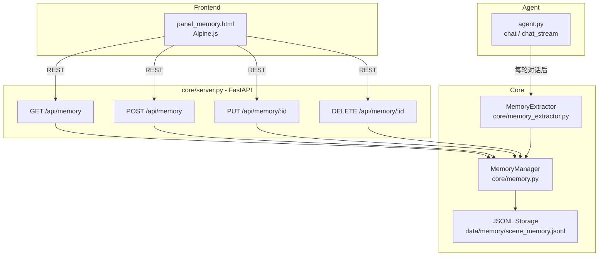

# 设计文档：记忆管理功能 (Memory Management)

## 概述

本设计在现有 `core/memory.py` 的基础上进行最小化扩展，为 openGuiclaw 添加结构化记忆管理能力。核心变更包括：

1. 为 `MemoryItem` 添加 `type` 字段，支持 6 种记忆类型
2. 新增 `core/memory_extractor.py`，封装 LLM 驱动的记忆自动提取逻辑
3. 在 `core/server.py` 中添加 `/api/memory` REST 端点
4. 新增前端面板 `templates/panels/panel_memory.html`

设计原则：**最小改动、向后兼容**。旧的无 `type` 字段的 JSONL 记录在加载时自动默认为 `fact` 类型。

---

## 架构



数据流：
- 前端面板通过 REST API 读写记忆
- `Agent.chat()` 在每轮对话结束后，在后台线程异步调用 `MemoryExtractor.extract_from_turn()`，不阻塞主流程
- 空闲超时（默认 30 分钟无新消息）触发 `MemoryExtractor.extract_from_conversation()`，对当前会话做一次完整批量提取
- `MemoryExtractor` 调用 LLM，解析结果后写入 `MemoryManager`

### 提取触发机制

| 触发方式 | 调用方法 | 时机 | 说明 |
|----------|----------|------|------|
| 每轮异步提取 | `extract_from_turn()` | 每次 `chat()` 返回后，后台线程执行 | 轻量判断，大多数情况返回 NONE，不阻塞对话 |
| 空闲超时批量提取 | `extract_from_conversation()` | 距上次消息超过 30 分钟 | 回顾整段会话，提取用户画像和经验教训 |

空闲超时通过 `Agent` 内已有的 `_evolution_loop` 后台线程实现，记录最后一次消息时间戳，定期检查是否超时。超时后对当前会话执行批量提取，并重置计时器，避免重复提取同一段对话。

---

## 组件与接口

### MemoryItem（扩展）

在现有字段基础上新增 `type` 和 `source` 字段：

```python
MEMORY_TYPES = {"fact", "skill", "error", "preference", "rule", "experience"}

class MemoryItem:
    def __init__(self, content: str, tags: List[str] = None, type: str = "fact", source: str = "manual"):
        ...
        self.type = type if type in MEMORY_TYPES else "fact"
        self.source = source  # "manual" | "auto_extracted"
```

`to_dict()` 和 `from_dict()` 同步更新，`from_dict()` 中 `type` 缺失时默认 `"fact"`。

### MemoryManager（扩展）

在现有 `add()` 方法签名中增加 `type` 和 `source` 参数：

```python
def add(self, content: str, tags: List[str] = None,
        type: str = "fact", source: str = "manual") -> MemoryItem:
    ...

def list_by_type(self, memory_type: str) -> List[MemoryItem]:
    """按类型过滤，返回匹配的记忆列表。"""
    return [m for m in self._memories if m.type == memory_type]

def update(self, memory_id: str, new_content: str = None,
           new_tags: List[str] = None, new_type: str = None) -> bool:
    """扩展 update，支持更新 type 字段。"""
    ...
```

### MemoryExtractor（新增）

`core/memory_extractor.py` 封装所有 LLM 提取逻辑，不依赖 MemoryManager 以外的任何模块：

```python
class MemoryExtractor:
    def __init__(self, llm_client, memory_manager: MemoryManager, model: str):
        ...

    def extract_from_turn(self, user_message: str, assistant_message: str) -> List[MemoryItem]:
        """单轮对话提取，大多数情况返回空列表。"""
        ...

    def extract_from_conversation(self, messages: List[dict]) -> List[MemoryItem]:
        """会话结束时批量提取用户画像信息。"""
        ...

    def extract_experience(self, messages: List[dict], task_result: str) -> List[MemoryItem]:
        """从已完成任务中提取经验，仅输出 skill/error/experience 类型。"""
        ...

    def _call_llm(self, prompt: str) -> str:
        """调用 LLM，返回原始文本。"""
        ...

    def _parse_response(self, raw: str) -> Optional[dict]:
        """解析 LLM 返回的 JSON，失败时返回 None 并记录日志。"""
        ...
```

### REST API 端点（新增）

在 `core/server.py` 中新增以下路由（位于现有 Session & Memory 区块之后）：

| 方法 | 路径 | 说明 |
|------|------|------|
| GET | `/api/memory` | 列出记忆，支持 `?type=` 和 `?q=` 过滤 |
| POST | `/api/memory` | 创建记忆，body: `{content, type?, tags?}` |
| PUT | `/api/memory/{id}` | 更新记忆，body: `{content?, type?, tags?}` |
| DELETE | `/api/memory/{id}` | 删除记忆 |

---

## 数据模型

### MemoryItem 字段

| 字段 | 类型 | 说明 | 默认值 |
|------|------|------|--------|
| `id` | str | `mem_` + 12位 hex | 自动生成 |
| `content` | str | 记忆内容 | 必填 |
| `type` | str | 记忆类型枚举 | `"fact"` |
| `tags` | List[str] | 标签列表 | `[]` |
| `source` | str | 来源标记 | `"manual"` |
| `timestamp` | float | Unix 时间戳 | 自动生成 |
| `created_at` | str | 格式化时间字符串 | 自动生成 |

### 记忆类型枚举

| 类型值 | 中文名 | 颜色 | 说明 |
|--------|--------|------|------|
| `fact` | 事实 | 蓝色 | 客观事实信息 |
| `skill` | 技能 | 绿色 | 成功模式/技能 |
| `error` | 教训 | 红色 | 错误教训 |
| `preference` | 偏好 | 紫色 | 用户偏好 |
| `rule` | 规则 | 黄色 | 规则约束 |
| `experience` | 经验 | 橙色 | 任务经验 |

### JSONL 存储格式（扩展后）

```json
{
  "id": "mem_a1b2c3d4e5f6",
  "content": "用户偏好使用 Python 3.11+",
  "type": "preference",
  "tags": ["python", "版本"],
  "source": "auto_extracted",
  "timestamp": 1700000000.0,
  "created_at": "2024-01-01 12:00:00"
}
```

### LLM 提取输出格式

```json
{
  "type": "preference",
  "subject": "用户",
  "predicate": "偏好",
  "content": "用户偏好使用 Python 3.11+",
  "importance": 3
}
```

或当无值得记录的信息时输出：`NONE`

---

## LLM 提取提示设计

### extract_from_turn 提示模板

```
你是一个记忆提取助手。分析以下对话轮次，判断是否包含值得长期记住的用户信息。

【判断标准】
- 只提取在未来新对话中仍有价值的信息
- 区分「用户长期特征」（偏好、身份、规则）和「一次性任务内容」
- 绝大多数对话轮次应输出 NONE
- 不要提取临时性、上下文相关的信息

【记忆类型】
- fact: 客观事实（用户的职业、所在地等）
- preference: 用户偏好（喜欢的工具、风格等）
- rule: 用户设定的规则约束
- skill: 用户擅长的技能或成功模式
- error: 需要避免的错误
- experience: 可复用的任务经验

用户: {user_message}
助手: {assistant_message}

如果有值得记录的信息，输出 JSON（单个对象）：
{{"type": "...", "subject": "...", "predicate": "...", "content": "...", "importance": 1-5}}
否则输出：NONE
```

---

## 正确性属性

*属性（Property）是在系统所有有效执行中都应成立的特征或行为——本质上是对系统应做什么的形式化陈述。属性是人类可读规范与机器可验证正确性保证之间的桥梁。*

### 属性 1：MemoryItem 往返序列化

*对于任意* 包含任意 `type`（6种类型之一）的 MemoryItem，调用 `to_dict()` 后再调用 `from_dict()` 应得到与原始对象字段完全相同的等价对象，包括 `type`、`content`、`tags`、`source` 字段。

**验证：需求 1.2、1.5**

### 属性 2：按类型过滤的完整性

*对于任意* 记忆集合和任意有效类型值，调用 `list_by_type(t)` 返回的所有条目的 `type` 字段都应等于 `t`，且原始集合中所有 `type == t` 的条目都应出现在结果中（无遗漏、无误包含）。

**验证：需求 1.4、2.2**

### 属性 3：API 增删往返

*对于任意* 有效的记忆内容，通过 `POST /api/memory` 创建后，`GET /api/memory` 应能检索到该条目；通过 `DELETE /api/memory/{id}` 删除后，`GET /api/memory` 不应再包含该 ID 的条目。

**验证：需求 2.1、2.4、2.6**

### 属性 4：API 更新往返

*对于任意* 已存在的记忆条目，通过 `PUT /api/memory/{id}` 更新 `content`、`type` 或 `tags` 后，`GET /api/memory` 返回的该条目应反映更新后的值。

**验证：需求 2.8**

### 属性 5：自动提取记忆的存储一致性

*对于任意* 通过 `extract_from_turn` 自动提取并写入的记忆条目，其在 JSONL 存储中的格式应与手动添加的记忆完全一致，且 `source` 字段为 `"auto_extracted"`，并可通过 `GET /api/memory` 正常检索。

**验证：需求 6.5、6.8**

### 属性 6：extract_experience 输出类型约束

*对于任意* 已完成任务的对话历史，`extract_experience` 方法提取的所有记忆条目的 `type` 字段都应属于 `{"skill", "error", "experience"}` 集合，不应包含其他类型。

**验证：需求 6.4**

### 属性 7：无效 JSON 不中断处理

*对于任意* LLM 返回无效 JSON 或字段缺失的情况，`_parse_response` 应返回 `None` 而不抛出异常，且不向 MemoryManager 写入任何条目，后续处理继续正常执行。

**验证：需求 6.6**

---

## 错误处理

| 场景 | 处理方式 |
|------|----------|
| `POST /api/memory` 缺少 `content` | FastAPI Pydantic 验证，返回 HTTP 422 |
| `DELETE /api/memory/{id}` ID 不存在 | `MemoryManager.delete()` 返回 `False`，API 返回 HTTP 404 |
| `PUT /api/memory/{id}` ID 不存在 | `MemoryManager.update()` 返回 `False`，API 返回 HTTP 404 |
| LLM 提取返回无效 JSON | `_parse_response` 返回 `None`，记录 `[MemoryExtractor] 解析失败` 日志，跳过 |
| LLM 提取返回 `NONE` | 正常情况，不写入任何记忆，不记录日志 |
| LLM 调用网络异常 | 捕获异常，记录日志，返回空列表，不中断 Agent 主流程 |
| JSONL 文件读取失败 | 现有 `_load()` 已处理，打印错误后继续 |
| 向后兼容：旧记录无 `type` 字段 | `from_dict()` 中 `type` 缺失时默认 `"fact"` |

---

## 测试策略

### 双轨测试方法

单元测试和属性测试互补，共同保证正确性：
- **单元测试**：验证具体示例、边界条件、错误处理
- **属性测试**：验证对所有输入都成立的通用规则

### 单元测试（pytest）

针对具体示例和边界条件：

```
tests/
  test_memory_item.py        # MemoryItem 字段、默认值、向后兼容
  test_memory_manager.py     # add/delete/update/list_by_type
  test_memory_api.py         # REST 端点（FastAPI TestClient）
  test_memory_extractor.py   # mock LLM，测试解析逻辑和错误处理
```

关键单元测试用例：
- `test_default_type_is_fact`：不指定 type 时默认为 fact
- `test_backward_compat_no_type`：从无 type 字段的旧 JSONL 加载，type 为 fact
- `test_post_missing_content_returns_422`：缺少 content 返回 422
- `test_delete_nonexistent_returns_404`：删除不存在 ID 返回 404
- `test_invalid_json_does_not_raise`：LLM 返回无效 JSON 不抛出异常

### 属性测试（Hypothesis）

使用 [Hypothesis](https://hypothesis.readthedocs.io/) 库，每个属性测试最少运行 100 次迭代。

```python
from hypothesis import given, settings
from hypothesis import strategies as st

MEMORY_TYPES = ["fact", "skill", "error", "preference", "rule", "experience"]

# 属性 1：MemoryItem 往返序列化
# Feature: memory-management, Property 1: MemoryItem round-trip serialization
@given(
    content=st.text(min_size=1),
    tags=st.lists(st.text()),
    memory_type=st.sampled_from(MEMORY_TYPES),
    source=st.sampled_from(["manual", "auto_extracted"])
)
@settings(max_examples=100)
def test_memory_item_round_trip(content, tags, memory_type, source):
    item = MemoryItem(content, tags, type=memory_type, source=source)
    restored = MemoryItem.from_dict(item.to_dict())
    assert restored.content == item.content
    assert restored.type == item.type
    assert restored.tags == item.tags
    assert restored.source == item.source

# 属性 2：按类型过滤的完整性
# Feature: memory-management, Property 2: type filter completeness
@given(
    items=st.lists(st.fixed_dictionaries({
        "content": st.text(min_size=1),
        "type": st.sampled_from(MEMORY_TYPES)
    }), min_size=0, max_size=20),
    filter_type=st.sampled_from(MEMORY_TYPES)
)
@settings(max_examples=100)
def test_type_filter_completeness(items, filter_type):
    manager = MemoryManager(data_dir=tmp_dir)
    for item in items:
        manager.add(item["content"], type=item["type"])
    results = manager.list_by_type(filter_type)
    assert all(r.type == filter_type for r in results)
    expected_count = sum(1 for i in items if i["type"] == filter_type)
    assert len(results) == expected_count
```

每个属性测试必须包含注释标签：
`# Feature: memory-management, Property {N}: {property_text}`

---

## 与现有系统的整合路径（未来方向）

本节描述记忆管理功能与现有系统深度整合的可能路径，不作为当前实现的核心。

### 与 KnowledgeGraph 的整合

当前 `KnowledgeGraph` 存储三元组（subject/relation/object），与 MemoryExtractor 输出的 subject/predicate/content 结构天然对应。未来可在 `extract_from_turn` 写入 MemoryManager 的同时，将高重要性（importance >= 4）的条目同步写入 KnowledgeGraph：

```python
# 未来扩展示意
if extracted.importance >= 4:
    self.kg.add(Triple(
        subject=extracted.subject,
        relation=extracted.predicate,
        object=extracted.content,
        source="memory_extractor"
    ))
```

### 与 Agent 系统提示的整合

`MemoryManager.build_context()` 已支持生成记忆上下文字符串。未来可按类型分层注入：
- `rule` 和 `preference` 类型注入系统提示（高优先级）
- `fact` 和 `skill` 类型注入用户消息前缀（中优先级）
- `experience` 和 `error` 类型在任务开始时按需检索（按需注入）

### 与向量搜索的整合

现有 `VectorStore` 已支持语义搜索。未来 `list_by_type()` 可结合向量搜索，实现「按类型 + 语义相关性」的复合检索，提升记忆召回质量。
