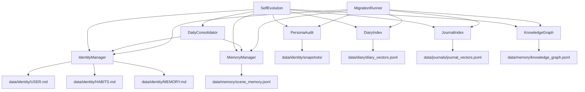

# 设计文档：Self-Evolution Refactor

## 概述

本设计旨在重构 openGuiclaw 的自我进化数据层，将散乱的 `data/` 根目录文件整理为清晰的分层结构，引入 Identity Layer（`data/identity/`），实现 DailyConsolidator 每日归纳器，并解决 `user_profile.json` 与 `interaction_habits.md` 的职责重叠问题。

设计原则：干净简洁，类似 openakita 风格；屏幕监控功能代码保留但默认注释禁用；日记功能（`DiaryManager` + `_write_diary()`）作为自我进化核心步骤保留。

---

## 架构

### 目标 data/ 目录结构

```
data/
├── diary/
│   ├── YYYY-MM-DD.md          # 日记文件（现有）
│   └── diary_vectors.jsonl    # 日记向量索引（从根目录迁移）
├── journals/
│   ├── YYYY-MM-DD.md          # 日志文件（现有）
│   └── journal_vectors.jsonl  # 日志向量索引（从根目录迁移）
├── memory/
│   ├── scene_memory.jsonl     # 情景记忆库（从根目录迁移）
│   ├── knowledge_graph.jsonl  # 知识图谱（从根目录迁移）
│   ├── store_index.json       # 向量存储索引（从根目录迁移）
│   └── consolidation_YYYY-MM-DD.json  # 每日归纳摘要
├── identity/
│   ├── USER.md                # 用户客观档案（替代 user_profile.json objective 层）
│   ├── HABITS.md              # 交互习惯与约束规则（替代 interaction_habits.md + subjective 层）
│   ├── MEMORY.md              # 进度记忆摘要，≤800字，每日刷新
│   └── snapshots/             # HABITS.md 历史快照（从 persona_snapshots/ 迁移）
├── migration_backup/
│   ├── migration_manifest.json
│   ├── migration_error.log    # 仅在迁移失败时生成
│   └── <timestamp>_<filename> # 原始文件备份
├── plans/                     # 现有，保留
├── scheduler/                 # 现有，保留
├── sessions/                  # 现有，保留
├── screenshots/               # 现有，保留
├── user_profile.json.bak      # 迁移后备份
└── interaction_habits.md.bak  # 迁移后备份
```

### 模块依赖关系



---

## 组件与接口

### 新增：`core/identity_manager.py`

管理 `data/identity/` 下的三个 Markdown 文件，替代 `UserProfileManager` 的 JSON 读写。

```python
class IdentityManager:
    def __init__(self, data_dir: str = "data")
    
    # 读写 USER.md
    def update_user(self, key: str, value: str) -> None
    def get_user(self) -> dict[str, str]
    
    # 读写 HABITS.md
    def append_habit(self, content: str) -> None
    def modify_habit(self, target: str, replacement: str) -> bool
    def get_habits(self) -> str
    
    # 读写 MEMORY.md（有字数上限）
    def write_memory(self, content: str) -> None  # 截断到 800 字
    def get_memory(self) -> str
    
    # 构建 system prompt 注入块
    def build_prompt(self) -> str
    
    # 从旧格式迁移（一次性）
    def migrate_from_legacy(
        self,
        profile_path: str,
        habits_path: str,
        identities_default_path: str = None
    ) -> None
```

**USER.md 格式示例：**
```markdown
# 用户档案 (USER)
<!-- updated: 2026-02-19 -->

- **姓名**: 张三
- **职业**: 软件工程师
- **设备**: MacBook Pro M3
```

**HABITS.md 格式示例：**
```markdown
# 交互习惯与约束规则 (HABITS)

## 来自 interaction_habits.md
（原有内容）

## 来自 user_profile.json subjective_memory
- **回复语言**: 中文
- **代码风格**: 下划线命名

<!-- 自动进化 2026-02-19 -->
（新追加内容）
```

**MEMORY.md 格式示例：**
```markdown
# 进度记忆摘要 (MEMORY)
<!-- updated: 2026-02-19 | 字数: 342/800 -->

（每日 DailyConsolidator 生成的摘要，≤800字）
```

---

### 新增：`core/daily_consolidator.py`

每日归纳器，同步 API（非 async），在跨天首次启动时触发。

```python
class DailyConsolidator:
    def __init__(
        self,
        client: OpenAI,
        model: str,
        identity: IdentityManager,
        memory: MemoryManager,
        journal: JournalManager,
        data_dir: str = "data",
        promotion_threshold: float = 0.8,
        similarity_threshold: float = 0.9,
    )
    
    def should_run(self) -> bool
    """检查今天是否已执行过归纳（读取 consolidation_YYYY-MM-DD.json）"""
    
    def run(self, date_str: str = None) -> dict
    """执行完整归纳流程，返回摘要统计"""
    
    def _summarize_journal(self, date_str: str) -> str
    """读取当日日志，调用 LLM 生成 ≤800字摘要"""
    
    def _promote_memories(self) -> int
    """扫描 scene_memory.jsonl，晋升 PERSONA_TRAIT 高置信度条目"""
    
    def _deduplicate_memories(self) -> int
    """去除相似度 > 0.9 的重复记忆条目"""
    
    def _save_report(self, date_str: str, stats: dict) -> None
    """保存 consolidation_YYYY-MM-DD.json"""
```

**触发机制：** 在 `SelfEvolution.evolve_from_journal()` 开头检查 `DailyConsolidator.should_run()`，若需要则先执行归纳再继续。

**consolidation_YYYY-MM-DD.json 格式：**
```json
{
  "date": "2026-02-19",
  "executed_at": "2026-02-19 02:30:00",
  "memory_summary_chars": 342,
  "promoted_count": 2,
  "deduplicated_count": 5
}
```

---

### 改造：`core/self_evolution.py`

主要变更：

1. **`__init__`**：
   - 新增 `identity: IdentityManager` 参数
   - 新增 `daily_consolidator: DailyConsolidator` 参数（可选）
   - `self.habits_path` 改为指向 `data/identity/HABITS.md`
   - `self.audit` 的 `persona_path` 改为 `data/identity/HABITS.md`

2. **`_extract_memories()`**：
   - `profile_updates` 中 `layer=objective` → 调用 `identity.update_user(key, val)`
   - `profile_updates` 中 `layer=subjective` → 调用 `identity.append_habit(content)`
   - 写入时附加时间戳注释 `<!-- updated: YYYY-MM-DD -->`
   - 保留 `user_profile` 参数的向后兼容调用（如果 `identity` 不存在则回退）

3. **`evolve_persona()`**：
   - `current_habits` 从 `identity.get_habits()` 读取
   - `append` 操作调用 `identity.append_habit(content)`
   - `modify` 操作调用 `identity.modify_habit(target, replacement)`

4. **`evolve_from_journal()`**：
   - 在 Step 1 前检查并执行 `DailyConsolidator`（如果已注入）

5. **屏幕监控相关注释**（`context.py` 中的 `[视觉日志]` 去重逻辑不在此文件，无需改动）：
   - `_agentic_exploration_enabled` 默认保持 `False`，无需额外注释

---

### 改造：`core/user_profile.py`

保持向后兼容接口，内部改为委托给 `IdentityManager`：

```python
class UserProfileManager:
    def __init__(self, data_dir: str, profile_filename: str = "user_profile.json",
                 identity_manager: IdentityManager = None)
    
    # 以下方法保持签名不变，内部路由到 IdentityManager
    def update_objective(self, key: str, value: str) -> None
    def update_subjective(self, key: str, value: str) -> None
    def get_all(self) -> dict
    def build_prompt(self) -> str  # 从 identity/ 读取
```

若 `identity_manager` 为 `None`，回退到原有 JSON 读写逻辑（完全向后兼容）。

---

### 改造：`core/persona_audit.py`

- `snapshot_dir` 从 `data/persona_snapshots/` 改为 `data/identity/snapshots/`
- `snapshot()` 方法的头部注释从固定 `PERSONA.md` 改为接受 `target_file` 参数
- 构造函数新增自动迁移逻辑：若旧目录存在且新目录不存在，自动迁移

```python
class PersonaAudit:
    def __init__(self, persona_path: str = "PERSONA.md", data_dir: str = "data")
    # snapshot_dir 自动设为 data/identity/snapshots/
    # 构造时检查并迁移 data/persona_snapshots/
    
    def snapshot(self, reason: str = "", target_file: str = "HABITS.md") -> Optional[Path]
    # 头部注释改为 <!-- Snapshot: {ts} | Target: {target_file} | Reason: {reason} -->
```

---

### 改造：`core/diary_index.py` / `core/journal_index.py`

- `DiaryIndex.__init__`：`index_file` 改为 `data/diary/diary_vectors.jsonl`
- `JournalIndex.__init__`：`index_file` 改为 `data/journals/journal_vectors.jsonl`
- 两者均在 `_load()` 前检查旧路径并自动迁移

```python
def __init__(self, embedding_client, data_dir: str = "data"):
    self.index_file = Path(data_dir) / "diary" / "diary_vectors.jsonl"
    # 自动迁移旧路径
    old_path = Path(data_dir) / "diary_vectors.jsonl"
    if old_path.exists() and not self.index_file.exists():
        self.index_file.parent.mkdir(parents=True, exist_ok=True)
        old_path.rename(self.index_file)
        print(f"[DiaryIndex] 已迁移索引文件: {old_path} → {self.index_file}")
```

---

### 新增：`scripts/migrate_data.py`

一次性数据迁移脚本，支持 dry-run 模式。

```python
class MigrationRunner:
    def __init__(self, data_dir: str = "data", dry_run: bool = False)
    
    def run(self) -> dict  # 返回 manifest
    def _backup_file(self, path: Path) -> Path
    def _move_file(self, src: Path, dst: Path) -> None
    def _migrate_user_profile(self) -> None
    def _migrate_vector_indices(self) -> None
    def _migrate_memory_files(self) -> None
    def _migrate_snapshots(self) -> None
    def _save_manifest(self, manifest: dict) -> None
```

**使用方式：**
```bash
# 预览迁移计划（不执行）
python scripts/migrate_data.py --dry-run

# 执行迁移
python scripts/migrate_data.py
```

---

## 数据模型

### USER.md 结构

纯 Markdown，每行一个键值对，格式 `- **key**: value`，文件头部有 `<!-- updated: YYYY-MM-DD -->` 注释。

解析规则：读取所有 `- **key**: value` 行，构建 `dict[str, str]`。

### HABITS.md 结构

自由 Markdown 文本，分节存储。`IdentityManager` 以追加/替换方式更新，不做结构化解析。`build_prompt()` 直接将全文注入 system prompt。

### MEMORY.md 结构

单一文本块，字数上限 800 字。每次 `DailyConsolidator` 运行时覆盖写入。文件头部有 `<!-- updated: YYYY-MM-DD | 字数: N/800 -->` 注释。

### scene_memory.jsonl（现有，路径迁移）

格式不变，迁移到 `data/memory/scene_memory.jsonl`。新增字段 `confidence`（浮点，0-1）和 `tags` 中的 `PERSONA_TRAIT` 标签用于晋升判断。

### consolidation_YYYY-MM-DD.json

```json
{
  "date": "YYYY-MM-DD",
  "executed_at": "YYYY-MM-DD HH:MM:SS",
  "memory_summary_chars": 342,
  "promoted_count": 2,
  "deduplicated_count": 5
}
```

---

## 正确性属性

*A property is a characteristic or behavior that should hold true across all valid executions of a system — essentially, a formal statement about what the system should do. Properties serve as the bridge between human-readable specifications and machine-verifiable correctness guarantees.*

### Property 1: 向量索引路径正确性

*For any* `DiaryIndex` 或 `JournalIndex` 实例，其 `index_file` 路径应分别为 `data/diary/diary_vectors.jsonl` 和 `data/journals/journal_vectors.jsonl`；`KnowledgeGraph` 和 `MemoryManager` 的数据文件路径应位于 `data/memory/` 子目录下。

**Validates: Requirements 1.1, 1.2, 1.3, 7.1, 7.2**

---

### Property 2: 旧路径自动迁移 round-trip

*For any* 临时数据目录，若旧路径文件存在而新路径文件不存在，初始化对应模块后，旧路径文件应不再存在，新路径文件应存在且内容与原文件完全相同。

**Validates: Requirements 1.4, 1.5, 7.3**

---

### Property 3: 迁移数据完整性

*For any* 包含任意键值对的 `user_profile.json`（objective 层）和任意内容的 `interaction_habits.md`，执行迁移后，`USER.md` 应包含所有 objective 键值对，`HABITS.md` 应包含所有 subjective 键值对及原 `interaction_habits.md` 的全部内容，且无内容丢失。

**Validates: Requirements 2.2, 2.3, 4.1**

---

### Property 4: 迁移备份保留

*For any* 执行迁移的数据目录，迁移完成后，原 `user_profile.json` 和 `interaction_habits.md` 应以 `.bak` 后缀保留，且备份文件内容与迁移前原文件内容完全相同。

**Validates: Requirements 2.4**

---

### Property 5: build_prompt 从 identity 读取

*For any* `IdentityManager` 实例，`build_prompt()` 返回的字符串应包含 `USER.md` 和 `HABITS.md` 的内容，而不依赖旧的 `user_profile.json` 文件。

**Validates: Requirements 2.5, 6.3**

---

### Property 6: 快照目录迁移 round-trip

*For any* 包含 `data/persona_snapshots/` 目录的数据目录，初始化 `PersonaAudit` 后，快照文件应出现在 `data/identity/snapshots/` 下，且原目录内容已迁移完整。

**Validates: Requirements 3.2**

---

### Property 7: 快照头部包含目标文件名

*For any* 调用 `PersonaAudit.snapshot(target_file="HABITS.md")` 生成的快照文件，其第一行应包含 `Target: HABITS.md` 字样。

**Validates: Requirements 3.3**

---

### Property 8: MEMORY.md 字数上限

*For any* 日志内容输入，`DailyConsolidator` 执行后写入 `MEMORY.md` 的正文内容（不含头部注释行）字数应不超过 800 字。

**Validates: Requirements 5.2, 5.3**

---

### Property 9: 记忆晋升 round-trip

*For any* `scene_memory.jsonl` 中标签包含 `PERSONA_TRAIT` 且 `confidence` 高于阈值的记忆条目集合，执行 `DailyConsolidator._promote_memories()` 后，这些条目应出现在 `HABITS.md` 或 `USER.md` 中，且不再存在于 `scene_memory.jsonl` 中。

**Validates: Requirements 5.4, 5.5**

---

### Property 10: 去重后无高相似度条目对

*For any* 包含重复或高度相似条目的 `scene_memory.jsonl`，执行 `DailyConsolidator._deduplicate_memories()` 后，剩余条目中不应存在任意两条相似度 > 0.9 的条目对。

**Validates: Requirements 5.6**

---

### Property 11: 记忆按 layer 路由

*For any* `_extract_memories()` 提取结果，`layer=objective` 的更新应写入 `USER.md`，`layer=subjective` 的更新应写入 `HABITS.md`，且两者均不写入旧的 `user_profile.json` 或 `interaction_habits.md`。

**Validates: Requirements 6.1, 6.2, 6.4**

---

### Property 12: 时间戳格式正确

*For any* 对 `USER.md` 或 `HABITS.md` 的写入操作，写入后文件中应包含格式为 `<!-- updated: YYYY-MM-DD -->` 的时间戳注释，且日期格式合法。

**Validates: Requirements 6.5**

---

### Property 13: 搜索结果迁移前后一致

*For any* 已索引的向量数据集和任意查询字符串，执行路径迁移后，`DiaryIndex.search()` 或 `JournalIndex.search()` 返回的结果（日期、文本、分数）应与迁移前完全相同。

**Validates: Requirements 7.4**

---

### Property 14: 迁移前备份存在

*For any* 执行迁移操作的数据目录，迁移开始后，`data/migration_backup/` 下应存在所有被迁移文件的备份，备份文件名包含时间戳。

**Validates: Requirements 8.1**

---

### Property 15: 迁移失败回滚

*For any* 在迁移过程中途抛出异常的场景，异常处理完成后，所有被操作的文件应恢复到迁移前的状态（原路径文件存在，新路径文件不存在或内容未变）。

**Validates: Requirements 8.2**

---

### Property 16: dry-run 不修改文件

*For any* 以 `dry_run=True` 运行的 `MigrationRunner`，执行 `run()` 后，`data/` 目录下所有文件的路径和内容应与执行前完全相同。

**Validates: Requirements 8.4**

---

## 错误处理

| 场景 | 处理策略 |
|------|---------|
| `USER.md` / `HABITS.md` 不存在 | `IdentityManager` 自动创建空文件，写入默认头部 |
| 旧路径迁移时目标目录不存在 | 自动 `mkdir(parents=True)` |
| 迁移过程中异常 | 捕获异常，回滚已移动文件，写入 `migration_error.log` |
| `MEMORY.md` 超过 800 字 | 截断到 800 字，末尾追加 `\n<!-- 内容已截断 -->` |
| `scene_memory.jsonl` 读取失败 | 跳过晋升/去重步骤，记录警告日志，不中断主流程 |
| LLM API 调用失败（归纳摘要） | 写入空摘要或上次摘要，记录错误，不阻塞启动 |
| `user_profile.json` 格式异常 | 回退到空 dict，打印警告，不抛出异常 |

---

## 测试策略

### 双轨测试方法

**单元测试**（具体示例与边界条件）：
- `IdentityManager` 初始化时自动创建三个文件
- `build_prompt()` 在文件为空时返回空字符串
- `DailyConsolidator.should_run()` 在当日 manifest 存在时返回 `False`
- `PersonaAudit.snapshot()` 生成的文件头部格式正确
- `MigrationRunner` dry-run 模式打印计划但不执行
- `migrate_data.py` 在 `migration_backup/` 不存在时自动创建

**属性测试**（普遍性质，随机输入）：

使用 Python 的 `hypothesis` 库，每个属性测试最少运行 100 次。

每个属性测试必须在注释中引用对应的设计属性，格式：
```python
# Feature: self-evolution-refactor, Property N: <property_text>
```

| 属性 | 测试方法 | 生成器 |
|------|---------|--------|
| P1 路径正确性 | 验证 `index_file` 属性值 | 随机 `data_dir` 字符串 |
| P2 旧路径迁移 | 构造临时目录，放置旧文件，初始化模块，验证迁移结果 | 随机文件内容 |
| P3 迁移数据完整性 | 生成随机 profile dict，迁移，验证 USER.md/HABITS.md 包含所有键值 | `st.dictionaries(st.text(), st.text())` |
| P4 备份保留 | 迁移后验证 .bak 文件内容与原文件相同 | 随机文件内容 |
| P5 build_prompt | 写入随机内容到 USER.md/HABITS.md，验证 build_prompt() 包含这些内容 | 随机文本 |
| P8 MEMORY.md 字数 | 生成随机长度日志，执行归纳，验证 MEMORY.md ≤ 800 字 | `st.text(min_size=0, max_size=5000)` |
| P9 记忆晋升 | 构造随机 PERSONA_TRAIT 条目，晋升后验证出现在目标文件且从 JSONL 删除 | 随机记忆条目列表 |
| P10 去重 | 构造随机相似条目，去重后验证无高相似度对 | 随机文本变体 |
| P11 layer 路由 | 生成随机 objective/subjective 提取结果，验证写入正确文件 | 随机 layer + key + value |
| P12 时间戳格式 | 写入后验证时间戳正则匹配 `<!-- updated: \d{4}-\d{2}-\d{2} -->` | 随机写入内容 |
| P13 搜索一致性 | 构造随机向量数据，迁移，对随机查询验证结果相同 | 随机向量 + 查询 |
| P15 迁移备份 | 执行迁移，验证 migration_backup/ 下备份文件存在 | 随机文件集合 |
| P16 迁移回滚 | 注入异常，验证文件状态回滚 | 随机失败点 |
| P17 dry-run | dry-run 后验证目录快照与执行前相同 | 随机数据目录 |

**测试文件结构：**
```
tests/
├── test_identity_manager.py      # P1, P3, P4, P5, P11, P12
├── test_daily_consolidator.py    # P8, P9, P10
├── test_migration.py             # P2, P14, P15, P16, P17
├── test_vector_indices.py        # P1, P2, P13
└── test_persona_audit.py         # P6, P7
```
