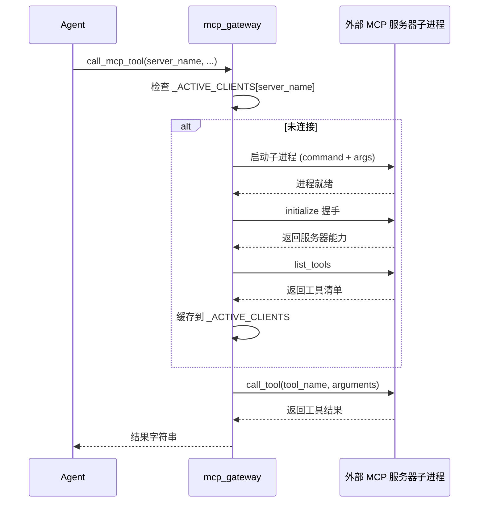
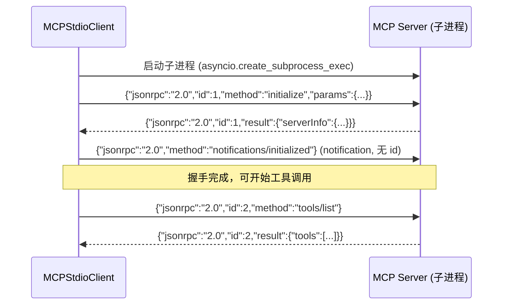

# MCP (Model Context Protocol) 集成

> OpenGuiclaw 完整的 MCP 双向集成：既可作为 **MCP 客户端**调用外部服务，又可作为 **MCP 服务器**将自身能力暴露给其他 AI 主机。

## 目录
- [架构概览](#架构概览)
- [客户端网关 (mcp_gateway)](#客户端网关-mcp_gateway)
  - [配置文件](#配置文件)
  - [可用工具](#可用工具)
  - [连接生命周期](#连接生命周期)
- [底层客户端 (MCPStdioClient)](#底层客户端-mcpstdioclient)
  - [JSON-RPC 握手流程](#json-rpc-握手流程)
  - [核心 API](#核心-api)
- [服务器模式 (mcp_server)](#服务器模式-mcp_server)
  - [暴露的工具](#暴露的工具)
  - [启动方式](#启动方式)
- [故障排查](#故障排查)

---

## 架构概览

OpenGuiclaw 的 MCP 集成由两个独立的方向构成：

```
┌─────────────────────────────────────────────────────────────┐
│                     OpenGuiclaw 进程                         │
│                                                             │
│  ┌───────────────────────┐   ┌─────────────────────────┐   │
│  │    客户端方向 (消费)   │   │   服务器方向 (暴露)      │   │
│  │                       │   │                         │   │
│  │  plugins/mcp_gateway  │   │   mcp_server.py         │   │
│  │     (AI 工具接口)     │   │   (FastMCP 服务器)       │   │
│  │         │             │   │         │               │   │
│  │  core/mcp_client.py   │   │   FastMCP ("openGuiclaw")│   │
│  │  (JSON-RPC 底层)      │   │                         │   │
│  └──────────┬────────────┘   └──────────┬──────────────┘   │
│             │                           │                   │
└─────────────│───────────────────────────│───────────────────┘
              │                           │
              ▼                           ▼
    外部 MCP 服务器             外部 MCP 客户端
   (Context7, Filesystem      (Claude Desktop,
    Playwright, etc.)          Cursor, etc.)
```

| 方向 | 文件 | 职责 |
|------|------|------|
| **客户端** | `plugins/mcp_gateway.py` | 调用外部 MCP 服务器的工具，注入到 Agent 技能库 |
| **底层通信** | `core/mcp_client.py` | 实现 JSON-RPC 2.0 over Stdio，供底层调用 |
| **服务器** | `mcp_server.py` | 将 OpenGuiclaw 的截图/执行能力通过 MCP 协议对外提供 |

---

## 客户端网关 (mcp_gateway)

`plugins/mcp_gateway.py` 是一个标准 [Plugin 插件](./plugins.md)，它在 Agent 启动时自动加载，并向 `SkillManager` 注册 4 个 MCP 管理工具。

### 配置文件

MCP 服务器的连接信息统一在 `config/mcp_servers.json` 中声明，格式遵循 Claude Desktop 的标准：

**文件路径：** `config/mcp_servers.json`

```json
{
  "mcpServers": {
    "服务器名称": {
      "command": "npx",
      "args": ["-y", "@some/mcp-package@latest"],
      "env": {
        "API_KEY": "${MY_API_KEY}"
      },
      "description": "可选的人类可读描述"
    }
  }
}
```

**字段说明：**

| 字段 | 类型 | 必填 | 说明 |
|------|------|------|------|
| `command` | string | ✅ | 启动服务器的可执行程序，如 `npx`、`node`、`python` |
| `args` | list | ✅ | 传给 `command` 的参数列表 |
| `env` | object | ❌ | 额外的环境变量；支持 `${VAR_NAME}` 引用宿主环境变量 |
| `description` | string | ❌ | 服务器描述，用于 `mcp_list_servers` 输出 |

**示例（内置的 context7 配置）：**

```json
{
  "mcpServers": {
    "context7": {
      "command": "npx",
      "args": ["-y", "@upstash/context7-mcp@latest"]
    }
  }
}
```

### 可用工具

网关注册完成后，Agent 可调用以下 4 个技能：

| 技能名 | 分类 | 说明 |
|--------|------|------|
| `call_mcp_tool` | system | 调用指定服务器上的指定工具（**核心工具**） |
| `mcp_list_servers` | system | 列出所有已配置的服务器及其连接状态 |
| `mcp_list_active` | system | 列出当前运行中（已连接）的服务器和工具数 |
| `mcp_disconnect` | system | 主动断开指定服务器的连接 |

**`call_mcp_tool` 参数详解：**

| 参数 | 类型 | 必填 | 说明 |
|------|------|------|------|
| `server_name` | string | ✅ | 对应 `mcp_servers.json` 中的键名 |
| `tool_name` | string | ✅ | 要调用的工具名；传入 `"discover"` 可列出所有可用工具 |
| `arguments` | string | ✅ | 工具参数的 **JSON 字符串**，无参数时传 `"{}"` |

**调用示例：**

**第一步：浏览可用工具**
```
tool_name = "discover"
arguments = "{}"
server_name = "context7"
```

**第二步：Context7 两阶段文档查询**
```
# 阶段 1: 解析库 ID
tool_name = "resolve-library-id"
arguments = "{\"libraryName\": \"fastapi\", \"query\": \"如何定义路由\"}"

# 阶段 2: 查询文档
tool_name = "query-docs"
arguments = "{\"libraryId\": \"/tiangolo/fastapi\", \"query\": \"如何定义路由\"}"
```

> [!IMPORTANT]
> `arguments` 必须是合法的 **JSON 字符串**（`dict` 序列化后的结果），而不是 Python `dict` 对象。传错类型会返回 `❌ arguments 必须是合法的 JSON 字符串`。

### 连接生命周期

`mcp_gateway` 采用**懒连接（Lazy Connect）**策略，服务器进程只在首次被调用时才启动：



所有与 MCP 服务器的 `async` 通信运行在一个**独立的后台线程**（`_mcp_thread`）中，通过 `asyncio.run_coroutine_threadsafe` 与主线程桥接，不会阻塞 Agent 的主事件循环。

程序退出时，`atexit.register(cleanup_all_clients)` 会自动关闭所有服务器子进程。

---

## 底层客户端 (MCPStdioClient)

`core/mcp_client.py` 提供了一个**轻量级的 MCP Stdio 客户端实现**，遵循 JSON-RPC 2.0 协议，适用于不依赖官方 `mcp` SDK 的场景（例如早期版本兼容或自定义集成）。

> [!NOTE]
> `mcp_gateway.py` **优先使用官方 `mcp` SDK**（`from mcp import ClientSession, StdioServerParameters`）。`MCPStdioClient` 是一个独立的底层备选实现，仅在需要时直接引用。

### JSON-RPC 握手流程

MCP 客户端与服务器必须在通信前完成标准的三步握手：



`initialize` 请求声明的客户端能力：

```json
{
  "protocolVersion": "2024-11-05",
  "clientInfo": { "name": "QwenAutoGUI-Client", "version": "1.0.0" },
  "capabilities": {
    "roots": { "listChanged": false },
    "sampling": {}
  }
}
```

### 核心 API

```python
from core.mcp_client import MCPStdioClient

# 创建客户端（Exec 模式）
client = MCPStdioClient(command="node", args=["server.js"])

# 也可使用 Shell 模式
client = MCPStdioClient(command="npx -y @some/mcp-server", shell=True)

# 连接并握手
await client.connect()
await client.initialize()

# 发现工具
tools = await client.list_tools()

# 调用工具
result = await client.call_tool("tool_name", {"param": "value"})

# 清理（关闭子进程）
await client.cleanup()
```

**`call_tool` 返回格式解析：**

MCP 规范的 `tools/call` 响应包含 `content` 数组，`MCPStdioClient` 会自动将所有 `type: "text"` 的块拼接为一个字符串返回。若服务器标记 `isError: true`，返回值会带有 `[Tool Error from Server]:` 前缀。

---

## 服务器模式 (mcp_server)

`mcp_server.py` 使用官方 `FastMCP` 框架，将 OpenGuiclaw 自身的**屏幕截图与 GUI 执行能力**以 MCP 协议对外提供，使得 Claude Desktop、Cursor 等支持 MCP 的 AI 主机能够直接驱动 OpenGuiclaw 执行桌面操作。

### 暴露的工具

| 工具名 | 说明 |
|--------|------|
| `capture_screenshot` | 截取主屏幕，返回 Base64 编码的 PNG 及宽高信息 |
| `execute_action` | 执行单步 GUI 动作（点击、输入、滚动、拖拽等） |
| `run_task` | 传入自然语言任务，由 Agent 自主完成（截图→分析→执行循环） |
| `get_screen_info` | 获取屏幕分辨率和多显示器信息 |

**`execute_action` 的 `action_type` 对照：**

| `action_type` | 必填参数 | 说明 |
|---------------|----------|------|
| `click` | `x`, `y` (0–1000 归一化) | 单击 |
| `double_click` | `x`, `y` | 双击 |
| `right_click` | `x`, `y` | 右键点击 |
| `type` | `text` | 键盘输入文本 |
| `press` | `keys` (list) | 组合键，如 `["ctrl","c"]` |
| `scroll` | `amount`, `x`, `y` | 滚动，`amount` 正值向下 |
| `drag` | `start_x`, `start_y`, `end_x`, `end_y` | 拖拽 |
| `move` | `x`, `y`, `duration` | 移动到坐标 |
| `wait` | `seconds` | 等待指定秒数 |

> [!IMPORTANT]
> 坐标系统使用 **0–1000 归一化坐标**，其中 `(500, 500)` 代表屏幕正中心，与屏幕实际分辨率无关。

### 启动方式

**直接运行（Stdio 模式，供 MCP 主机对接）：**

```bash
python mcp_server.py
```

**在 Claude Desktop 的 `claude_desktop_config.json` 中配置：**

```json
{
  "mcpServers": {
    "openGuiclaw": {
      "command": "python",
      "args": ["D:/openGuiclaw/mcp_server.py"]
    }
  }
}
```

配置完成后，Claude Desktop 重启即可看到 `capture_screenshot`、`execute_action` 等工具出现在工具列表中。

---

## 故障排查

### ❌ MCP SDK 未安装

**症状：** 调用 `call_mcp_tool` 返回 `❌ MCP SDK 未安装`

**解决方案：**
```bash
pip install mcp
```

### ❌ 服务器连接失败

**症状：** 返回 `❌ 连接失败: ...`，通常是子进程无法启动。

**可能原因与解决方案：**

| 原因 | 检查方式 | 解决 |
|------|----------|------|
| `command` 未安装 | `npx --version` | 安装 Node.js / `npm install -g ...` |
| `args` 包路径错误 | 手动运行 `npx -y <package>` | 确认包名拼写 |
| 网络超时（首次下载 npx 包） | 观察命令行日志 | 配置国内镜像或预先安装 |
| 环境变量缺失 | 检查 `env` 字段配置 | 在 `config/mcp_servers.json` 中补全 `env` |

### ❌ 工具调用超时

**症状：** 调用工具后长时间无响应，最终出现超时错误。

`call_tool` 的默认超时为 **60 秒**。对于耗时较长的任务（如大量文件操作），这属于正常现象。若频繁超时，检查服务器本身的性能。

### ⚠️ 工具返回空结果

**症状：** 调用成功但返回 `⚠️ 工具返回空结果`。

这通常是服务器端的工具本身返回了空的 `content` 数组，需查阅该 MCP 工具的具体文档确认其预期行为。

---

## 🛠️ 未来优化方向

1. **资源与提示支持 (Resources & Prompts)**：扩展客户端与服务器，支持 MCP 协议中的资源读取和预定义提示词功能。
2. **连接池优化**：针对频繁调用的轻量级 MCP 工具，优化子进程复用与连接池管理策略。
3. **安全沙箱集成**：为外部 MCP 工具调用引入权限控制与执行沙箱，限制敏感文件系统或网络的非法访问。
4. **可视化排障面板**：在系统控制台提供 MCP 通讯的实时监控与 JSON-RPC 报文抓取功能。

---

*相关文档：[Plugin 插件系统](./plugins.md) | [Agent 主循环](./agent.md)*
